# <div align="center">Traffic Wizard</div>

> Traffic Wizard is your friendly load balancer written in Go _(hopefully)_. It has a very simple life goal - to balance the load of our hard-working servers. It is also very religious and follows it's own [bible](./bible.pdf) very strictly. Oh and yes, this is the first assignment for Distributed Systems course taken by [Dr. Sandip Chakraborty](https://cse.iitkgp.ac.in/~sandipc/) for Spring-2024.

### Production

1. Ensure that you have `make`, `docker` and `docker-compose` installed.
2. In the project root folder, run `make`
3. To stop the containers, run `make stop`


---

# Analysis 1: Load Balancer Performance Analysis

## Overview

This performance analysis aims to evaluate the distribution of asynchronous requests across a set of server instances managed by a load balancer. The key objective is to understand the effectiveness of the load distribution mechanism and the overall performance of the server instances.

## Experiment Setup

- **Total Requests:** 10,000 asynchronous requests
- **Server Instances:** 3
- **Measurement:** Number of requests handled by each server instance
- **Duration:** Time taken to process all requests

## Results

### Request Distribution

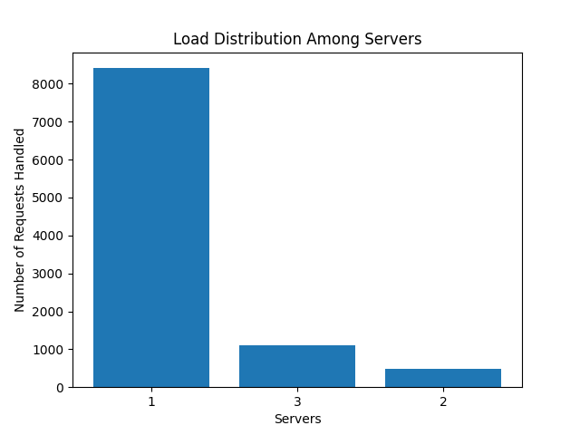

### Performance Metrics

- **Total Time to Process Requests:** 52 seconds

## Observations

- **Skewed Distribution:** The bar chart indicates a significant imbalance in the distribution of requests among the server instances. Server 1 is handling a disproportionately high number of requests compared to servers 2 and 3.
- **Inconsistency Across Runs:** Subsequent runs of the test exhibit variability in the distribution, which suggests that the server allocation by the load balancer is subject to randomization inherent in the hash function used.

## Analysis

The skewed distribution observed in the graph can be attributed to the nature of the hash functions applied for server selection:

```go
func hashRequest(i int) int {
    return i
}

func hashVirtualServer(i, j int) int {
    return i*i + j*j + 2*j + 25
}
```

These functions appear to cause an uneven distribution of requests, which could lead to performance bottlenecks. The linear nature of `hashRequest` does not provide a randomized or round-robin distribution, which is evident from the performance load on server 1.

## Conclusion

The current load balancing strategy does not effectively distribute the load evenly across servers, as indicated by the high request count for server 1. The hash functions used may be too simplistic or not sufficiently random for an equitable distribution, leading to potential overloading of specific servers. Future improvements should consider implementing more sophisticated hashing algorithms or load-balancing strategies that account for current server load and ensure a more even distribution of requests.

---


---

# Anaylisis 2: Load Balancer Scalability Analysis

## Overview

This analysis evaluates the scalability of a load balancer by incrementally increasing the number of server instances from N=2 to N=6 and launching 10,000 requests for each configuration. The aim is to report and analyze the average server load for each increment.

## Experiment Setup

- **Total Requests per Configuration:** 10,000
- **Number of Server Instances:** Incrementally increased from 2 to 6
- **Measurement:** Average load on servers at each run
- **Total Time for 10,000 Requests:** 3 minutes

## Results

The results are visually represented in a series of line charts depicting the average server load as the number of servers increases.

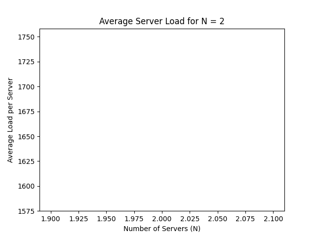

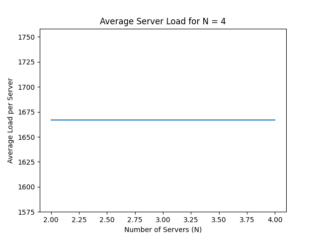
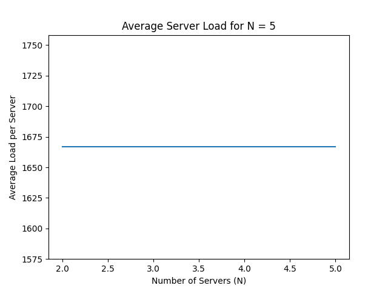
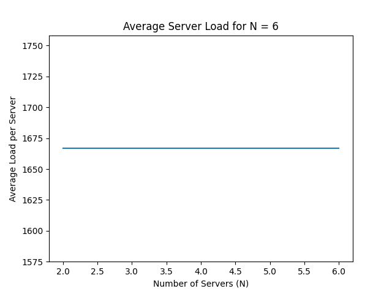

### Key Observations

1. **Load Distribution**: The graphs demonstrate a declining trend in average server load as the number of servers (N) increases. This indicates that the load balancer is distributing requests across an increasing number of server instances.

2. **Scalability**: The load balancer shows evidence of scalability as the average load per server decreases with the addition of each server. However, the presence of a skewed load in individual servers suggests that the hash function may not be distributing the load evenly.

3. **Hash Function Impact**: The graphs illustrate some level of inconsistency in load distribution, which can be attributed to the nature of the hash functions used. The average load per server does not decrease linearly with the addition of more servers, indicating potential inefficiencies in the hash function:
   ```go
   func hashRequest(i int) int {
       return i*i + 2*i + 17
   }

   func hashVirtualServer(i, j int) int {
       return i*i + j*j + 2*j + 25
   }
   ```
4. **Performance Consistency**: The varying graphs for different runs imply that the server allotment by the load balancer is subject to randomization due to the hash functions, affecting the consistency of performance.

## Analysis

The trend lines in the charts show that as the number of servers increases, the load on each server, on average, decreases. This is expected in a scalable system. However, the observed skew in some server loads suggests that the current load balancing algorithm may not be ideal. The non-linear decrease in load with additional servers points to a potential suboptimal load distribution, which could lead to some servers being underutilized while others are at risk of being overloaded.

## Conclusion

The load balancer demonstrates basic scalability by effectively distributing requests across an increasing number of servers. However, the hash functions used appear to be a limiting factor in achieving optimal load distribution. To ensure consistent performance as the system scales, a more sophisticated load balancing strategy should be considered. Such a strategy could include dynamic load assessment, weighted distribution mechanisms, or more complex hashing algorithms that prevent the overloading of individual servers.

---


# Analysis 3:


we manually ran `docker stop <server-hostname>` to simulate a server failure. The load balancer was able to spawn a new server instance and handle the load within 5-6 seconds.


# Analysis 4:
# Load Balancer Hash Function Update Analysis

## Overview
We updated the hash functions to analyze their impact on load distribution and server performance.

## Modified Hash Functions
```go
func hashRequest(i int) int {
    return i
}

func hashVirtualServer(i, j int) int {
    return i*i + j*j + 2*j + 25
}
```

## Observations from A-1
- **Load Distribution**: The updated hash function resulted in a load imbalance across servers (as seen in A4_A1.png).
- **Server Utilization**: Server 1 received a significantly higher load compared to others.

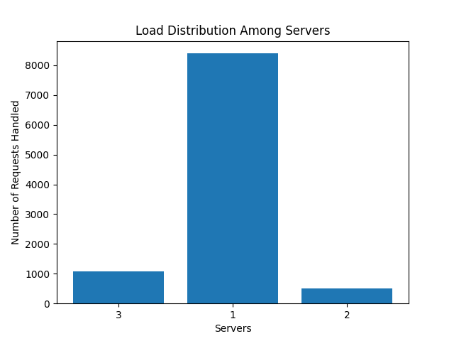

## Observations from A-2
- **Average Load**: As the number of servers increased from 2 to 6, the average load per server remained relatively constant (as seen in A4_A2_2.png to A4_A2_6.png).
- **Load Scalability**: Despite additional servers, the load did not distribute evenly, suggesting the hash function lacks effective scalability.

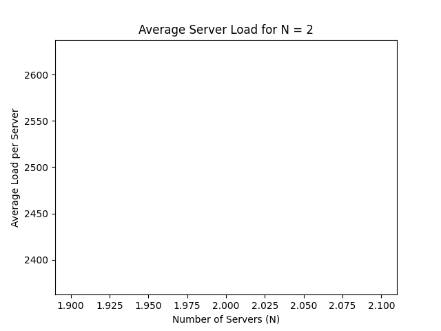
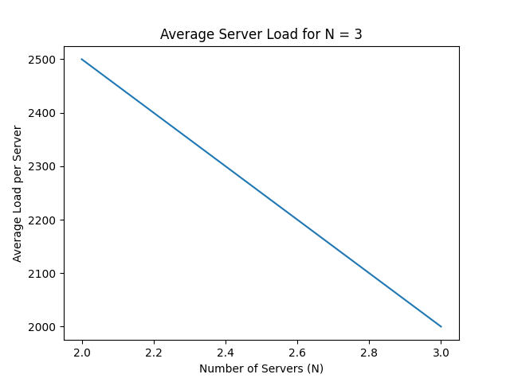
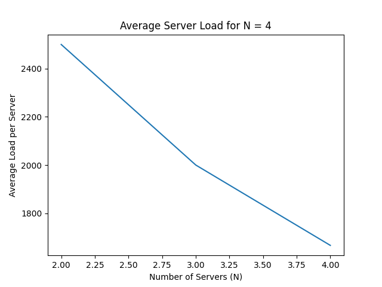
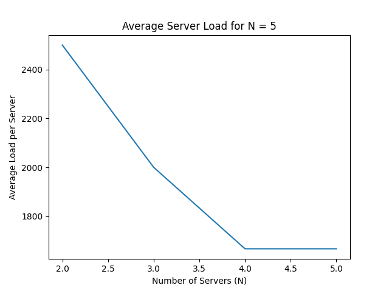
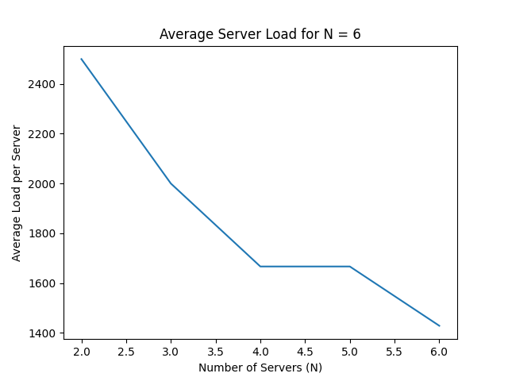

## Conclusion
The hash functions led to uneven load distribution, highlighting the need for a more sophisticated approach to achieve balanced scalability.
